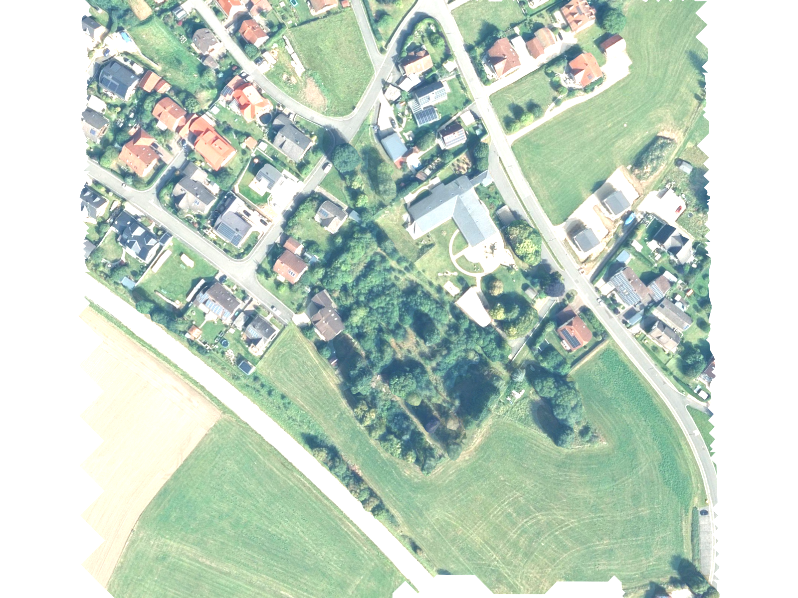
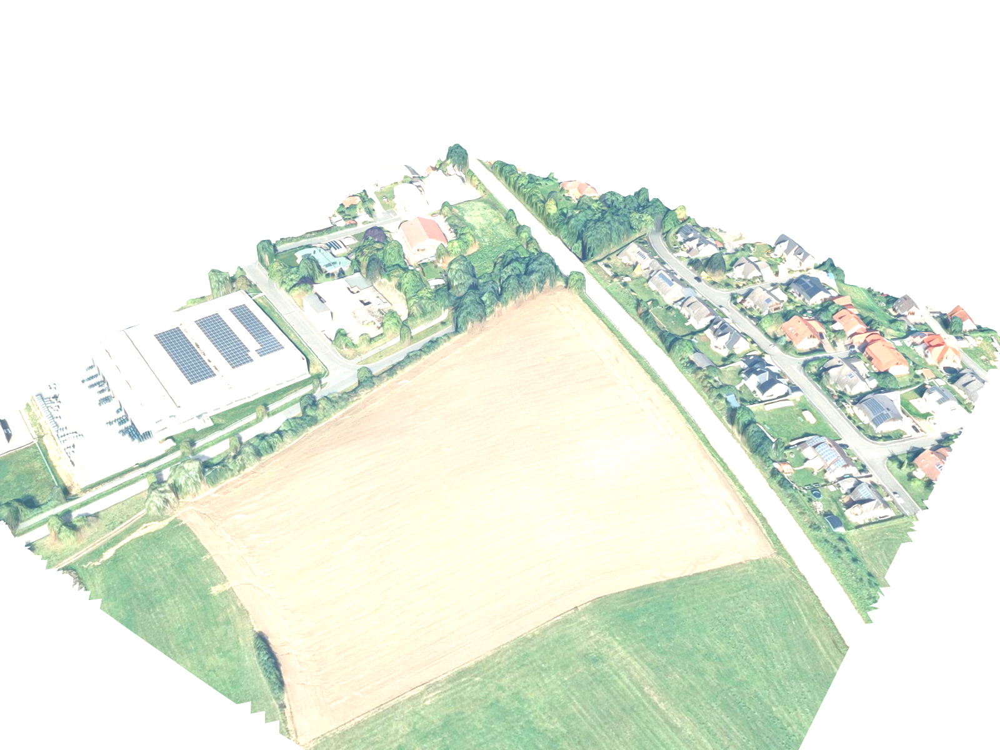
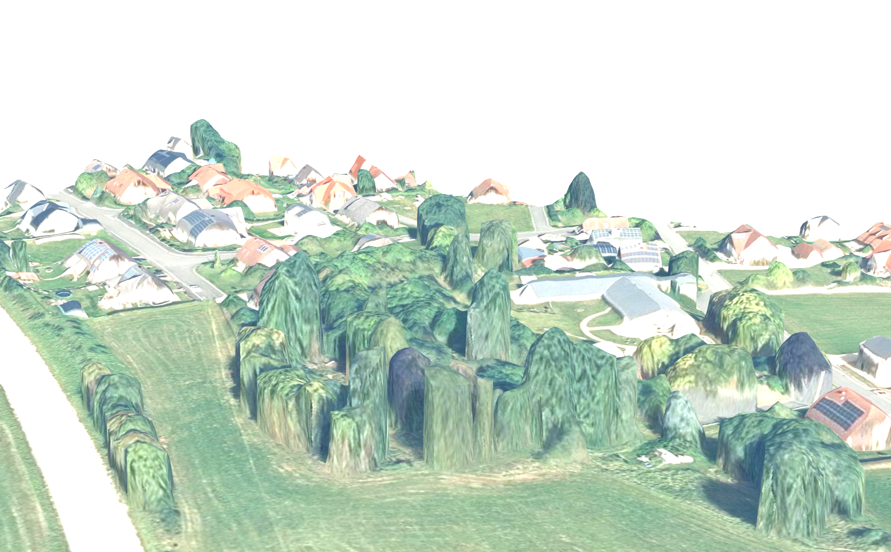
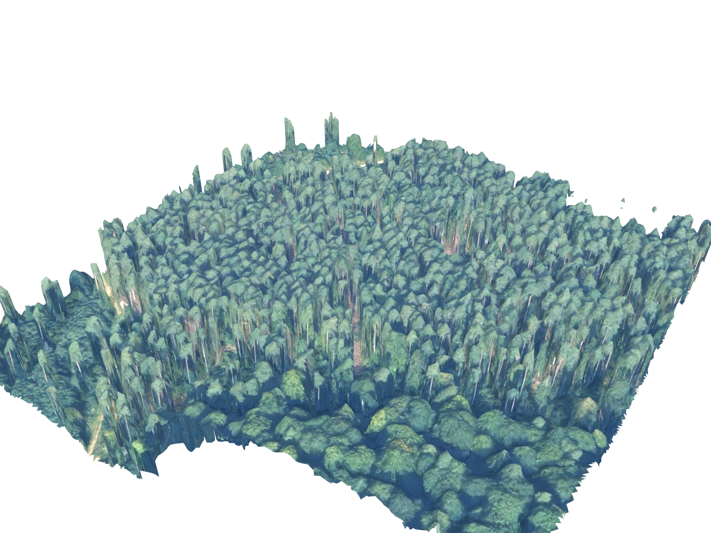

# DOM-Mesh polygon cutout — spike

> **Goal:** pull a small AOI out of Bayern's DOM-Mesh (`pn=dommesh`) **without downloading the
> full 50–200 GB SLPK** — by HTTP range-requesting only the I3S nodes that overlap the polygon.
> Same idea as OpenMap_Unifier ("cut exactly what you need").
> **Result:** ~5–15 MB fetched for a 300 × 300 m chunk vs ~99 GB for the whole Los (≈ 0.01 %).

Status: **working proof of concept** (2026-05-11), Blender 5.1.

## Gallery

| | |
|---|---|
|  |  |
| **Clean 300 × 300 m cutout, top-down** — Auerbach i.d.OPf.; triangles clipped to the AOI rectangle, so it's exactly the patch we asked for. | **Oblique** — building volumes, tree canopies and terrain slope are all present in the mesh, not just a flat photo. |
|  |  |
| **Low-angle close-up** — the characteristic photogrammetry look (reconstructed roofs, "melting" trees). | **Same pipeline, forest AOI** (Veldensteiner Forst) — works on any land cover. |

(More raw renders in `out_auerbach2/`, `out_altstadt/`, `out_forest/`.)

## What we learned about the format

- DOM-Mesh is delivered **only** as `DSM_Mesh.slpk` per flight-day "Los"
  (`https://download{1,2}.bayernwolke.de/p/dom-mesh-slpk/<LOSID>/DSM_Mesh.slpk`).
  Los index KML: `https://geodaten.bayern.de/odd/m/3/daten/DOMMesh/DOM_Mesh_projektgebiete_2026.kml`.
  There is **no** server-side sub-region/tile selector (unlike DOP/DGM, which have `opendatagrid` / `poly2metalink`).
- An SLPK is a **ZIP64** archive of **I3S 1.9 `meshpyramids`** (OGC I3S community standard).
  The probed Los `125023_0` is 99 GB / ~435 k entries.
- `download*.bayernwolke.de` honours **HTTP `Range` requests** (Ceph RGW / S3-style, returns `206 Partial Content`) — that's what makes the cutout possible.
- Archive layout is convenient: node geometry/texture files are near the **start**; the
  `nodepages/*.json.gz` block (~13 MB — *all* node bounding boxes) and `3dSceneLayer.json.gz`
  sit **contiguously near the end**, just before the ZIP64 central directory (~62 MB).
  So: one ~62 MB read for the file table, one ~13 MB read for every node's bbox, then ~2 small range reads per overlapping node.
- **All OBB centers/halfSizes are in EPSG:25832 directly**, quaternions are identity → AOI
  filtering is a plain 2D AABB test, no ECEF math. (Heights: DHHN2016 / EPSG:7837.)
- Geometry (`nodes/<res>/geometries/0.bin.gz`): `PerAttributeArray`, header = `vertexCount`
  (u32) + `featureCount` (u32), then `vertexCount` × `position` (f32 × 3, **relative to the
  node's OBB center**) then `vertexCount` × `uv0` (f32 × 2). Non-indexed triangle soup.
  (`geometries/1.bin.gz` is the Draco-compressed variant — ignored here; the uncompressed one is right next to it.)
- Texture (`nodes/<res>/textures/0.jpg`): plain JPEG, UVs in [0, 1] (we write `1-v` for OBJ).

## Pipeline / files

| file | what it does |
|---|---|
| `probe1.py`, `probe2.py` | locate & download the ZIP64 central directory (one ~62 MB read) → `entries.json` |
| `probe3.py`, `probe4.py` | format reconnaissance (verify coordinate frame, check the nodepages block is contiguous) |
| `slpklib.py` | tiny helper to read a single ZIP entry by HTTP range |
| `slpk_index.py` | one ~13 MB range read → all node bounding boxes → `nodes_all.json` (108 326 nodes, 81 605 leaves) + `3dSceneLayer.json` |
| `cutout.py <out_dir> <cx> <cy> [half_m]` | pick leaf nodes whose OBB overlaps the AOI, range-fetch their `geometries/0.bin.gz` + `textures/0.jpg`, decode, **clip triangles to the AOI by centroid**, write anchored `cutout.obj` + `cutout.mtl` + `tex/*.jpg` + `meta.json` |
| `render.py` / `render_close.py` | Blender 5.1 headless: import OBJ (Z-up), white world + sun, flat material, render PNG |

### Reproduce

```powershell
cd experiments/dommesh_cutout
$py = "C:\ProgramData\anaconda3\python.exe"
& $py probe1.py            # prints ZIP64 EOCD offsets
& $py probe2.py            # downloads central directory -> cd.bin, entries.json  (~62 MB, ~30 s)
& $py slpk_index.py        # -> nodes_all.json, 3dSceneLayer.json  (~13 MB read)
& $py cutout.py out_test 690137 5506889 160      # AOI center in EPSG:25832, half-size in m
& "C:\Program Files\Blender Foundation\Blender 5.1\blender.exe" --background --python render.py -- "$PWD\out_test\cutout.obj" "$PWD\out_test\oblique.png" oblique 1600
```

> **Not committed** (regenerable, large): `cd.bin` (~60 MB), `entries.json` (~29 MB),
> `nodes_all.json` (~35 MB), `out_*/cutout.obj` (~14–62 MB each), `out_*/tex/`, `__pycache__/`.
> Run `probe2.py` → `slpk_index.py` → `cutout.py` to regenerate them. The committed PNGs,
> `meta.json`, `3dSceneLayer.json` and `nodepage0.json` are the documentation artifacts.

## Results

| output dir | where (EPSG:25832 center) | leaf nodes | triangles | bytes fetched | wall time |
|---|---|---|---|---|---|
| `out_forest` | Veldensteiner Forst (E687499 N5503504) | 36 | ~340 k | 14 MB | 88 s |
| `out_auerbach2` | Auerbach i.d.OPf., Gewerbe-/Wohngebiet (E689907 N5506859) | ~26 | 78 k | 5.5 MB | 23 s |
| `out_altstadt` | Auerbach i.d.OPf., residential ring (E690137 N5506889) | 14 | 71 k | 5.7 MB | 29 s |

(Wall time is dominated by sequential range requests — see TODO.) Each `out_*/meta.json`
records the exact AOI bbox, anchor, node count and bytes fetched for that run.

## TODO if productionised

- Polygon (not just rectangle) AOI; exact triangle clipping at the AOI edge.
- Write `.glb` instead of `.obj` (binary, ~10× smaller; proper PBR material for the Blender extension).
- Auto-pick the Los from the AOI via the project-areas KML; resolve the Bayern-Nord/Süd Los
  overlap (the KML polygon ≠ the actual coverage there).
- Parallelise the per-node range requests (currently sequential → ~0.3 s/request dominates).
- Cache `entries.json` + `nodes_all.json` per Los.
- Optionally wire this in as a `dommesh` source in OpenMap_Unifier.
